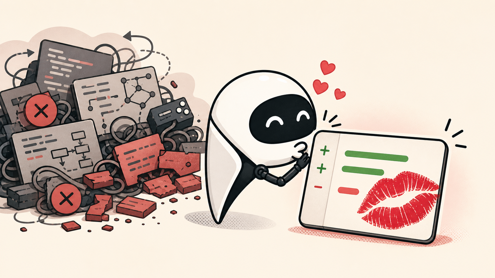

# kiss-my-diff

[English](README.md)



AI coding agent 通常能把任務做完。麻煩的是，完成之後你還想不想親自讀那個 diff。

KISS 是 Keep It Simple, Stupid。放到 coding-agent diff 裡，就是少繞路、少碰檔案、不要把小 bugfix 做成小框架。

Benchmark 結果：patch 小 31%，觸碰檔案少 20%。

`kiss-my-diff` 是一份很小的 [`AGENT.md`](AGENT.md)，用經典軟體工程原則提醒 agent：先讀現有程式、沿用既有模式、做最小可讀修改、不要藏錯誤或非法狀態、驗證結果，然後停手。

## 這份檔案

```text
Build only what is needed now.
Prefer the smallest readable change.
Read the existing code before editing.
Use existing helpers and patterns before adding new code.
Use built-ins before adding dependencies.
Touch the fewest files needed.
Do not add abstractions for one-shot code.
Preserve existing behavior unless asked to change it.
Do not hide errors or invalid states.
Verify with the smallest relevant test.
Stop when done.
```

## 為什麼需要

會通過測試，不代表 diff 好讀。常見問題不是 AI 寫不出來，而是它做太多：多改檔案、重複既有 helper、擴大重寫範圍、加不必要的抽象，或把一個小 bugfix 做成一套小架構。

這份檔案不是要 agent 變保守，而是把它拉回當前任務：理解現有程式，改剛好需要的地方，驗證，然後收手。

## Benchmark 摘要

這是一組小型 benchmark，不是嚴格證明，也不是模型排行榜。它問的是比較窄的問題：在模型本來就能解的任務上，這份規則能不能讓解法更小、更集中？

這裡合併了兩組 benchmark snapshot：8 個 bugfix 任務、4 個模型，baseline 和 `kiss-my-diff` 各跑兩次。合計是 64 次 baseline run 和 64 次 `kiss-my-diff` run。另外也用同一組 8 題、4 個模型，單獨重跑一句 KISS prompt，共 32 次。

| variant | runs | 正確率 | 觸碰檔案數 | patch 大小 |
| --- | ---: | ---: | ---: | ---: |
| baseline | 64 | 100.00 | 1.97 | 39.34 lines |
| `kiss-my-diff` | 64 | 96.88 | 1.58，少 19.84% | 27.23 lines，小 30.78% |
| 一句 KISS | 32 | 93.75 | 1.62，少 17.77% | 24.50 lines，小 37.72% |

正確率是公開測試 35% 加隱藏測試 65%。

在這個較大的池子裡，較強模型加上 `kiss-my-diff` 後維持 100% 正確率。一句版 patch 更短，但正確率更差。所以這是 diff discipline harness，不是正確率保證。

Benchmark harness 和題目都放在 [`benchmark/`](benchmark/) 裡。hidden tests 也有放進 repo，方便重現；只是 runner 在 agent 解題時不會把 hidden tests 放進工作區。

### 各模型結果

這張表不是在排模型強弱，而是讓你看同一個模型在不同 prompt 下的變化。觸碰檔案和 patch 大小越低，代表修改越集中。

| 模型 | variant | 正確率 | 觸碰檔案數 | patch 大小 |
| --- | --- | ---: | ---: | ---: |
| `gpt-5.5` | baseline | 100.00 | 1.88 | 34.19 lines |
| `gpt-5.5` | `kiss-my-diff` | 100.00 | 1.44 | 23.31 lines |
| `gpt-5.5` | 一句 KISS | 87.50 | 1.25 | 16.38 lines |
| `gpt-5.4` | baseline | 100.00 | 1.94 | 36.69 lines |
| `gpt-5.4` | `kiss-my-diff` | 100.00 | 1.69 | 29.38 lines |
| `gpt-5.4` | 一句 KISS | 100.00 | 1.62 | 24.38 lines |
| `gpt-5.4-mini` | baseline | 100.00 | 2.31 | 54.56 lines |
| `gpt-5.4-mini` | `kiss-my-diff` | 100.00 | 1.69 | 31.50 lines |
| `gpt-5.4-mini` | 一句 KISS | 100.00 | 1.88 | 26.00 lines |
| `gpt-5.3-codex-spark` | baseline | 100.00 | 1.75 | 31.94 lines |
| `gpt-5.3-codex-spark` | `kiss-my-diff` | 87.50 | 1.50 | 24.75 lines |
| `gpt-5.3-codex-spark` | 一句 KISS | 87.50 | 1.75 | 31.25 lines |

### Before / After Diff

其中一題是 API response decoding。原本的程式會用預設值吞掉壞掉的 upstream response；任務要求改成明確丟出 `ResponseDecodeError`。兩邊都通過公開測試和隱藏測試，但 diff 長相不同。

沒有 `kiss-my-diff`：觸碰 2 個檔案，32 行 diff。

```diff
diff --git a/api/response.py b/api/response.py
 import json
+
+from api.errors import ResponseDecodeError
+
+REQUIRED_FIELDS = ("id", "status", "items")

 def parse_response(raw):
     try:
         payload = json.loads(raw)
-    except ValueError:
-        return {"id": None, "status": "unknown", "items": []}
+    except ValueError as exc:
+        raise ResponseDecodeError("Response is not valid JSON") from exc
+
+    if not isinstance(payload, dict):
+        raise ResponseDecodeError("Response payload must be an object")
+
+    missing_fields = [field for field in REQUIRED_FIELDS if field not in payload]
+    if missing_fields:
+        raise ResponseDecodeError(
+            f"Response payload is missing required fields: {', '.join(missing_fields)}"
+        )
+
+    if not isinstance(payload["items"], list):
+        raise ResponseDecodeError("Response payload field 'items' must be a list")

     return {
-        "id": payload.get("id"),
-        "status": payload.get("status", "unknown"),
-        "items": payload.get("items", []),
+        "id": payload["id"],
+        "status": payload["status"],
+        "items": payload["items"],
     }

diff --git a/tests/test_response.py b/tests/test_response.py
+def test_top_level_payload_must_be_an_object():
+    with pytest.raises(ResponseDecodeError):
+        parse_response('["not", "an", "object"]')
```

有 `kiss-my-diff`：觸碰 1 個檔案，22 行 diff。

```diff
diff --git a/api/response.py b/api/response.py
 import json
+
+from api.errors import ResponseDecodeError

 def parse_response(raw):
     try:
         payload = json.loads(raw)
-    except ValueError:
-        return {"id": None, "status": "unknown", "items": []}
+    except ValueError as exc:
+        raise ResponseDecodeError("Response body is not valid JSON.") from exc
+
+    if not isinstance(payload, dict):
+        raise ResponseDecodeError("Response payload must be a JSON object.")
+
+    for field in ("id", "status", "items"):
+        if field not in payload:
+            raise ResponseDecodeError(f"Response payload is missing required field: {field}.")
+
+    if not isinstance(payload["items"], list):
+        raise ResponseDecodeError("Response field 'items' must be a list.")

     return {
-        "id": payload.get("id"),
-        "status": payload.get("status", "unknown"),
-        "items": payload.get("items", []),
+        "id": payload["id"],
+        "status": payload["status"],
+        "items": payload["items"],
     }
```

重點不是誰比較聰明，而是在同樣能修好的情況下，`kiss-my-diff` 比較常把修改留在該改的地方。

## 使用方式

把 [`AGENT.md`](AGENT.md) 放到 coding agent 會工作的 repo 根目錄。

## 授權

MIT。見 [`LICENSE`](LICENSE)。
